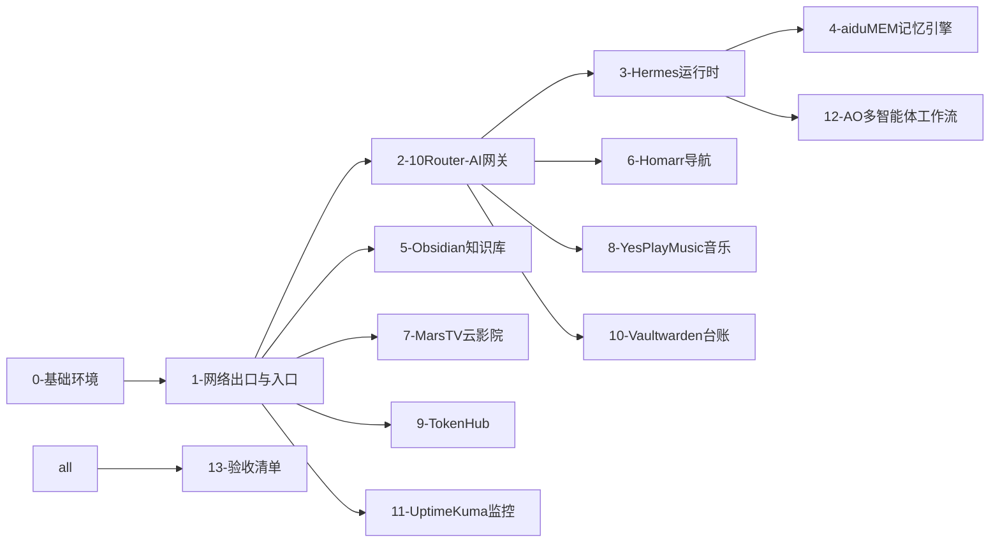

# 🚀 家庭 AI 服务器 · 全栈复刻路线图

> **这份文档是什么**：一套自托管家庭 AI 服务器系统的完整复刻文档入口。照着 `replication/` 目录从 `0-` 一直装到 `13-`，你会得到一套与本仓维护者**同款体验**的系统。
>
> **复刻哲学：同款体验，可换皮**。所有服务、自动化、联动流程与你拿到的一模一样；但**域名、账号、口令、数据全部是复刻者自己的**——本仓不迁移任何数据，每份指南都会教你在自己的环境里"从零重建"出等价数据。

## 阅读约定

- 全文环境特定值一律用占位符：`<你的域名>`、`<内网IP>`、`<内网IP备用>`、`<Tailscale IP>`、`<统一口令>`、`<台账账号>`、`<机场A>`、`<机场B>`、`<出口服务器>`。含义对照见仓根 README 的占位符体系说明。
- 每份指南结构固定：**是什么 → 上游原址 → 部署 → 配置 → 数据重建 → 服务联动 → 验证 → 升级回滚**。
- 命令均在实际运行环境取证导出（Ubuntu 22.04 x86_64），照抄可跑；遇到版本差异按上游官方文档微调。
- **国内网络加速提示**：ghcr.io 镜像拉取失败时换加速前缀（如 `ghcr.mirror.1ms.run/...` 或 `docker.1ms.run` 系加速站）；git clone GitHub 失败可走 `https://ghfast.top/https://github.com/<org>/<repo>.git` 形态的加速代理（本机 AI Token 大盘即此法装的）；Releases 二进制下载失败同理加前缀。加速站属第三方，稳定性自负，装完建议核对版本/校验。

## 部署阶段总览（编号即顺序，依赖从左到右）

关键依赖只有三条：**万物依赖 0/1**（Docker、网络出口）；**AI 链路依赖 2**（所有走 LLM 的服务从 10Router 拿统一出口）；**日常入口是 6**（Homarr 挂全部服务卡片）。其余可并行。

## 全服务一览（端口/形态/指南索引）

| # | 组件 | 入口端口 | 形态 | 指南 |
|---|------|---------|------|------|
| 0 | 基础环境 | — | Ubuntu + Docker + Git | `replication/0-基础环境.md` |
| 1 | sing-box 出口 | `<内网IP>:7892/7894` | 系统服务 | `replication/1-网络出口与入口.md` |
| 1 | Tailscale 组网 | — | 系统服务 | 同上 |
| 1 | monpanel 统一入口 | `8443`(HTTPS) / `8444`(跳转) | 自研·用户级服务（源码 `assets/monpanel/`） | 同上 |
| 2 | 10Router AI 网关 | `<内网IP>:20128` | Docker | `replication/2-10Router-AI网关.md` |
| 3 | Hermes Agent + 网页版 | `<内网IP>:8648` | venv + 系统服务 | `replication/3-Hermes-Agent运行时.md` |
| 4 | aiduMEM 记忆引擎 | `<内网IP>:8767` | venv 用户级服务 | `replication/4-aiduMEM记忆引擎.md` |
| 4 | embedding-server | `127.0.0.1:8769` | venv 用户级服务 | 同上 |
| 5 | Obsidian 知识库 | `<内网IP>:8083`（Web） | Docker | `replication/5-Obsidian知识库.md` |
| 6 | Homarr 导航面板 | `<内网IP>:7575` | Docker | `replication/6-Homarr导航面板.md` |
| 7 | MarsTV 云影院 | `<内网IP>:8082`（前端）/`8090`（后端）/`8095`（蜘蛛） | 自研·nginx + uvicorn + node（源码 `assets/martv-source.tar.gz`） | `replication/7-MarsTV云影院.md` |
| 8 | YesPlayMusic 音乐 | `<内网IP>:8660` | Docker + 补丁（`assets/yesplaymusic-patches/`） | `replication/8-YesPlayMusic音乐.md` |
| 9 | TokenHub 代币管家 | `<内网IP>:20129` | 裸机 node 系统服务（MariaDB） | `replication/9-TokenHub.md` |
| 10 | Vaultwarden 密码台账 | `https://<你的域名>:8445`（nginx 门面 :8445） | Docker ×2 | `replication/10-Vaultwarden台账.md` |
| 11 | Uptime Kuma 监控 | `<内网IP>:8081` | 裸机 node 用户级服务 | `replication/11-UptimeKuma监控.md` |
| 12 | AO 多智能体工作流 | `<内网IP>:20132`（大盘）/`20133`（交接面板） | npm 全局 + systemd（面板源码 `assets/ao-handover/`） | `replication/12-AO多智能体工作流.md` |
| 12 | la-sub-server 订阅服务 | `<内网IP>:20131` | 用户级服务（配合代理订阅分发） | 同上 |
| 12 | metacubexd 面板 | `<内网IP>:9097` | Docker（Clash 系面板） | 同上 |

## 自研资产索引（随仓发布，复刻者可直接用）

| 资产 | 说明 | 指南 |
|---|---|---|
| `assets/monpanel/` | 统一 HTTPS 入口 + 主机监控面板（FastAPI） | 1 |
| `assets/10router-patches/` | 10Router 中国大陆网络增强补丁 ×2 | 2 |
| `assets/martv-source.tar.gz` | MarsTV 云影院全源码（app+scripts+spider） | 7 |
| `assets/yesplaymusic-patches/` | YPM 播放链路补丁 + 音源健康巡检 | 8 |
| `assets/ao-handover/` | AO 交接面板（只读 sidecar） | 12 |
| `hooks/` + `.gitallowed` | Git 仓库防线（提交规范 + 真值扫描） | 0 |

## 数据重建承诺（"可换皮"的落地方式）

| 数据类型 | 复刻方式 |
|---------|---------|
| LLM 渠道与密钥 | 在 10Router 面板自行添加自己的渠道（指南给结构模板） |
| 影视库 | MarsTV 采集引擎自动重新刮削（cron 四件套自带） |
| 音乐歌单 | 登录自己的账号重建（MUSIC_U cookie 即身份） |
| 密码台账 | Vaultwarden 新库，逐条录入或导入 |
| 监控项 | Uptime Kuma 按验收清单的必监表手工添加 |
| 记忆库 | aiduMEM 空库启动，随使用自动生长 |

## 验收

全部装完后按 `replication/13-验收清单.md` 逐项打勾——每个服务的入口可达性 + 一条真实功能链路。
